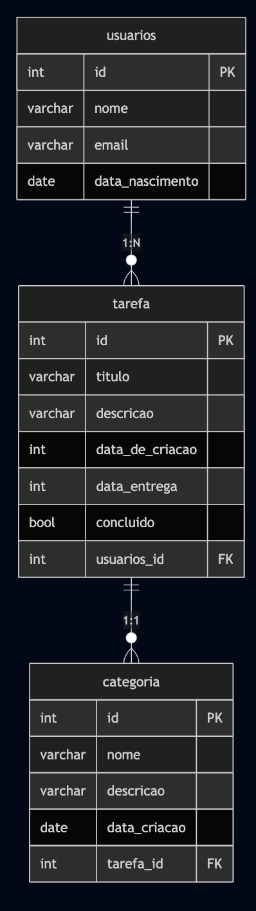
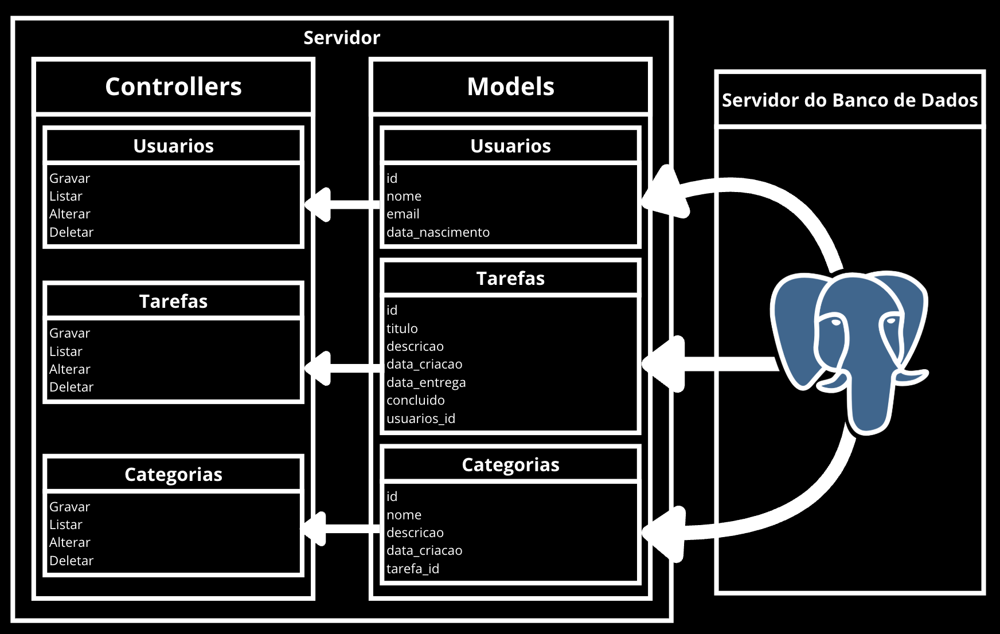

# Web Application Document (WAD)

## Introdução

Este projeto é uma aplicação web que utiliza Node.js e PostgreSQL como tecnologias principais. A estrutura do sistema foi organizada com a separação clara de responsabilidades entre controladores, modelos, serviços e migrações. Trata de um sistema voltado especialmente para iniciantes e atividades acadêmicas, oferecendo uma base prática para o desenvolvimento backend com banco de dados relacional.

## Diagrama do Banco de Dados

O banco de dados foi estruturado a partir de um modelo simples, incluindo, por exemplo, uma tabela de usuários. As migrações responsáveis pela criação das tabelas encontram-se no diretório `/migrations/scripts` e são organizadas em ordem cronológica de execução, conforme o timestamp presente no nome de cada arquivo.

> O modelo relacional do banco de dados está representado na imagem abaixo:



> O modelo físico do banco de dados está representado abaixo:

``` 
CREATE TABLE IF NOT EXISTS usuarios (
  id SERIAL PRIMARY KEY,
  nome VARCHAR(100) NOT NULL,
  email VARCHAR (70),
  data_nascimento DATE
);

CREATE TABLE IF NOT EXISTS tarefa (
  id SERIAL PRIMARY KEY,
  titulo VARCHAR(200) NOT NULL,
  descricao VARCHAR(500) NOT NULL,
  data_criacao DATE,
  data_entrega DATE,
  concluido BOOLEAN NOT NULL,
  usuarios_id INTEGER,
  FOREIGN KEY (usuarios_id) REFERENCES usuarios(id)
);

CREATE TABLE IF NOT EXISTS categoria (
  id SERIAL PRIMARY KEY,
  nome VARCHAR(50) NOT NULL,
  descricao TEXT,
  data_criacao DATE,
  tarefa_id INTEGER,
  FOREIGN KEY (tarefa_id) REFERENCES tarefa(id)
);
```

## Modelagem de Dados

### Modelo de Usuário:

- `id`: chave primária (serial, gerado automaticamente).
- `nome`: nome do usuário no sistema.
- `email`: email único do usuário.
- `data_nascimento`: data de nascimento do usuário.

---

### Modelo de Tarefa:

- `id`: chave primária (serial).
- `titulo`: título da tarefa.
- `descricao`: descrição detalhada da tarefa.
- `data_criacao`: data que a tarefa foi criada.
- `data_entrega`: data limite para concluir a tarefa, se aplicável.
- `concluido`: valor booleano (`true` ou `false`) indicando se a tarefa foi concluída.
- `usuarios_id`: chave estrangeira (UUID) que referencia o `id` da tabela de usuários.

---

### Modelo de Categoria:

- `id`: chave primária (serial).
- `nome`: nome da categoria (ex.: "Trabalho", "Estudos").
- `descricao`: descrição da categoria.
- `data_criacao`: data de criação da categoria.
- `tarefa_id`: chave estrangeira que referencia o `id` da tabela de tarefas.

---

## Arquitetura 

Neste projeto, foi implementada a arquitetura **MVC (Model-View-Controller)** com as seguintes camadas:

- **Model:** Responsável pela comunicação com o banco de dados.
- **Controller:** Responsável por receber as requisições, tratar os dados e interagir com os Services.
- **Service:** Camada intermediária que faz as regras de negócio e interage diretamente com o Model.

As **views** não estão presentes neste projeto, pois trata-se de uma API REST.

---

### Diagrama MVC do Projeto:




## WebAPI e Endpoints 


### Endpoints de Usuários

- **POST** `/api/usuarios`  
Cria um novo usuário.  
Exemplo de corpo da requisição:
```json
{
  "nome": "Usuario Teste",
  "email": "usuario@email.com",
  "data_nascimento": "2004-11-19"
}
````
- GET `/api/usuarios`
Lista todos os usuários cadastrados.

- PUT `/api/usuarios/:id`
Atualiza informações de um usuário com base no seu ID.

- DELETE `/api/usuarios/:id`
Deleta um usuário com base no seu ID.

---

### Endpoints de Tarefas
- **POST** `/api/tarefas`  
Cria uma nova tarefa.  
Exemplo de corpo da requisição:

```json
{
  "titulo": "Estudar Programação",
  "descricao": "Revisar conceitos de backend",
  "data_criacao": "2025-05-26",
  "data_entrega": "2025-06-01",
  "concluido": false,
  "usuarios_id": "uuid_do_usuario"
}

````

- GET `/api/tarefas`
Lista todas as tarefas cadastradas.

- PUT `/api/tarefas/:id`
Atualiza informações de uma tarefa com base no seu ID.

- DELETE `/api/tarefas/:id`
Deleta uma tarefa com base no seu ID.

---

### Endpoints de Categorias
- **POST** `/api/categorias`  
Cria uma nova categoria.  
Exemplo de corpo da requisição:

```json
{
  "nome": "Trabalho",
  "descricao": "Tarefas profissionais",
  "data_criacao": "2025-05-26",
  "tarefa_id": 1
}


````

- GET `/api/categorias`
Lista todas as categorias cadastradas.

- PUT `/api/categorias/:id`
Atualiza informações de uma categoria com base no seu ID.

- DELETE `/api/categorias/:id`
Deleta uma categoria com base no seu ID.
